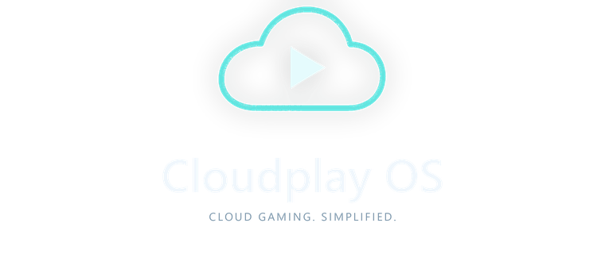

# Cloudplay OS

<p align="center">
  
</p>

Cloudplay OS turns a Raspberry Pi into a cloud-gaming appliance, with a branded
startup screen and Wi-Fi setup when needed. Services open in full-screen
Chromium; there is no desktop or operating-system account wizard.

Cloudplay OS boots to a controller-friendly **Cloudplay OS Main Menu** with
branded entries for **GeForce NOW** and **Xbox Cloud Gaming**. Native recovery
controls return to the active service, reload it, or close it and return to the
Main Menu. The menu, both provider entry points and keyboard return flow are
validated on CM5 test hardware; broader gameplay, controller, network and
display acceptance remains in progress.

It uses [Chromium with Raspberry Pi HEVC support](https://github.com/sslivins/chromium-rpi-hevc)
and the [GeForce NOW compatibility extension](https://github.com/sslivins/gfn-pi-compat).
The browser runs as an unprivileged user with its normal sandbox.

**Development beta:** [download beta 2](https://github.com/sslivins/cloudplay-os/releases/tag/v0.1.0-beta.2).
Download the `.img.xz` release asset and `SHA256SUMS`. There is no stable
release; 4K streaming and HDR display output are not yet validated.

## What you need

- Raspberry Pi 5, or Compute Module 5 with a suitable carrier.
- A microSD card; 32 GB is recommended for development.
- An HDMI display, keyboard and mouse, and suitable power and cooling.
- Ethernet or Wi-Fi and an account for at least one available service.
  Game access, availability and features depend on the provider, region and
  membership.

Raspberry Pi 5 has built-in Wi-Fi. Wireless is optional on Compute Module 5;
"Lite" refers to the absence of eMMC, not Wi-Fi.

## Getting started

1. Download the `.img.xz` and `SHA256SUMS` release assets linked above.
2. Verify the image against `SHA256SUMS`.
   In Raspberry Pi Imager, choose **Use custom** and select the `.img.xz` file.
3. Select the intended card and flash it. **Flashing erases that card.** Never
   overwrite storage that the flashing machine is currently booted from.
   Skip Imager's account and SSH customization; Cloudplay provides its own.
4. Insert the card, connect the display and input devices, and power on.
   Ethernet is the simplest first-boot connection.
5. With networking available, Cloudplay opens the Main Menu. Choose GeForce NOW
   or Xbox Cloud Gaming, sign in, and select a game. Keep a keyboard and mouse
   available for sign-in.

### Cloudplay OS Main Menu

Choose a service using the D-pad and A, or keyboard arrows/Tab and Enter.
Keep a keyboard and mouse available for sign-in and unsupported controllers.

From any service page—including browser error pages—press **Ctrl+Alt+Home**
(then release), or hold **Select/Back + Start/Menu together for two seconds**.
A native confirmation offers **Return to _provider_**, **Reload _provider_**,
and **Cloudplay OS Main Menu**; returning to the provider is selected first.
B or Escape cancels.

Returning Home **stops the entire streaming browser**, not just its visible tab.
Reload also closes and reopens the service, so either action may end your game.
Your sign-in data is retained: the existing NVIDIA profile is preserved and
Xbox uses a separate persistent profile. Controller support requires a standard
gamepad with D-pad, A/B and Select/Start; unsupported or unavailable controllers
do not disable keyboard/mouse navigation.

### Network setup

Ethernet and saved Wi-Fi connections skip setup. If a connection is needed,
choose your country and Wi-Fi network on the display, then enter its password.
The optional phone-setup flow displays a temporary hotspot name, password and
QR code; follow the on-screen instructions to join it.

For networks that need advance configuration, see
[boot-partition Wi-Fi provisioning](docs/maintenance.md#optional-boot-partition-provisioning).
Enterprise Wi-Fi requires separate administrator configuration.

### Development SSH

**These previews deliberately include a public development login:**

```sh
ssh cloud@DEVICE_IP
```

Username and password are both **`cloud`**. The same password is required for
`sudo`. Use a trusted development network and do not expose this SSH service
to the Internet.

The administrator is separate from the browser account. Root and the browser
user cannot log in over SSH. To build without development access, set
`CLOUDPLAY_DEVELOPMENT_SSH=0` in `config` before building.

For logs, access controls and recovery, see [maintenance](docs/maintenance.md).

## Limitations

- This is an unsigned development image, not a supported production OS.
- Real Wi-Fi/hotspot behavior, peripherals, gameplay and display compatibility
  still need broader hardware coverage. See the
  [hardware acceptance checklist](docs/hardware-acceptance.md).
- 4K and HDR are development targets, not advertised working features.
  Decoding HDR-encoded video does not establish HDR output to the display.
- Service sign-in persists locally. Browser data is not encrypted at rest;
  protect physical access to the card.
- OTA is experimental; there is no supported OTA-capable download yet.
  [A/B development images](docs/ota-images.md) require a deliberate reflash,
  signed trust configuration, and additional safety acceptance. The published
  preview is updated by reflashing. Chromium packages are held at the pinned
  version, so ordinary OS package upgrades do not update the browser.

## Building

The [GitHub Actions workflow](https://github.com/sslivins/cloudplay-os/actions/workflows/build-image.yml)
builds an unsigned ARM64 preview and uploads the image, checksums and provenance
as a short-lived artifact. Maintainers can start it with **Run workflow**.

For a local build, use a dedicated native ARM64 Linux machine with the host
dependencies listed in the workflow and a clean, committed checkout:

```sh
sudo bash scripts/build-image.sh
```

Images and checksums are written under `build/pi-gen/deploy/`. Do not run
privileged image builds on a shared production host.

Run the repository checks with:

```sh
python3 -m unittest discover -s tests
python3 scripts/artifacts.py validate
```

Architecture, dependency maintenance, diagnostics and HDR requirements are
documented in [maintenance](docs/maintenance.md).

## License

Cloudplay's recipe, helpers and theme are [MIT licensed](LICENSE). Bundled OS
and browser packages retain their own licenses and source-distribution
obligations. NVIDIA, GeForce NOW, Xbox and Xbox Cloud Gaming names and logos
belong to their respective owners. Cloudplay OS is not affiliated with or
endorsed by NVIDIA or Microsoft.
